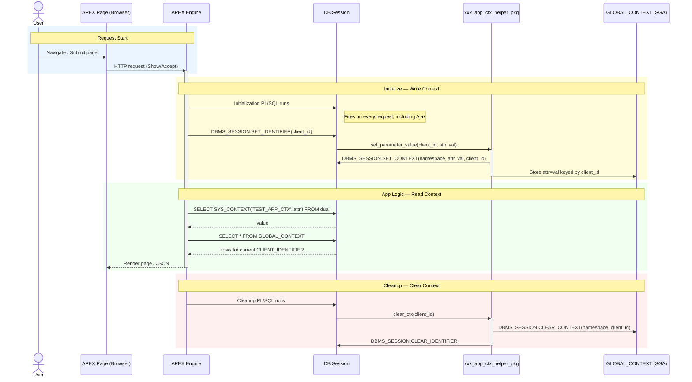

import Tabs from '@theme/Tabs';
import TabItem from '@theme/TabItem';
import PlantUML from '@site/src/components/plantUML';

# APEX Global Context — Request Flow

Sequence diagram showing the full request lifecycle: initialization, context write, SQL read, response, and cleanup.

:::tip Diagram Tips
- **PlantUML tab** — renders as an image; click to zoom (via medium-zoom).
- **Mermaid tab** — inline SVG; scroll horizontally if cut off.
:::

<Tabs>
  <TabItem value="plantuml" label="PlantUML" default>

<PlantUML>{`
@startuml

title APEX request setting and using a GLOBAL application context

actor User as U
participant "APEX Page Request\\n(Browser)" as B
participant "APEX Engine\\n(App Builder runtime)" as A
participant "DB Session\\n(V$SESSION.CLIENT_IDENTIFIER)" as S
participant "APPS.xxx_app_ctx_helper_pkg" as P
database "GLOBAL_CONTEXT\\n(SGA, keyed by CLIENT_IDENTIFIER)" as G

== Request lifecycle ==
U -> B: Navigate / Submit page
B -> A: HTTP request (Show/Accept)
activate A

A -> S: Initialization PL/SQL runs\\n(after APP_USER established)
note right of S
APEX init block executes early per request
APEX 23.1: Security Attributes → Database Session
end note

== Set Context ==
A -> S: DBMS_SESSION.SET_IDENTIFIER(:APP_USER or custom)
S -> P: P.set_parameter_value(client_id, attr, val)
activate P
P -> S: DBMS_SESSION.SET_CONTEXT(namespace, attr, val, client_id)
P -> G: Store/associate attr=val for client_id
deactivate P

== Read Context ==
A -> S: SELECT SYS_CONTEXT('TEST_APP_CTX','attr') FROM dual;
S --> A: value
A -> S: SELECT * FROM GLOBAL_CONTEXT;
S --> A: rows visible for current CLIENT_IDENTIFIER

== Response ==
A --> B: Render page/JSON
deactivate A

== Cleanup ==
A -> S: Cleanup PL/SQL runs
S -> P: P.clear_ctx(client_id)
activate P
P -> G: DBMS_SESSION.CLEAR_CONTEXT(namespace, client_id)
P -> S: DBMS_SESSION.CLEAR_IDENTIFIER
deactivate P

@enduml
`}</PlantUML>

  </TabItem>
  <TabItem value="mermaid" label="Mermaid">

  </TabItem>
</Tabs>
